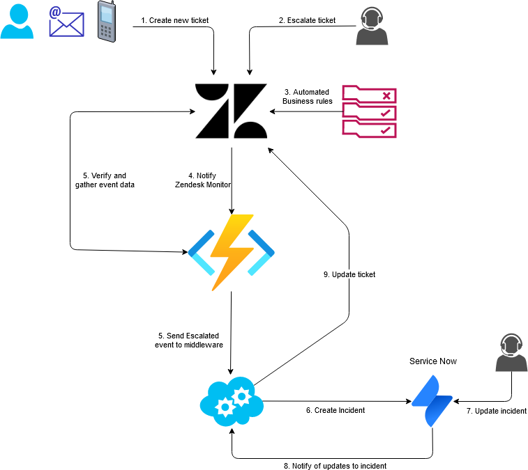
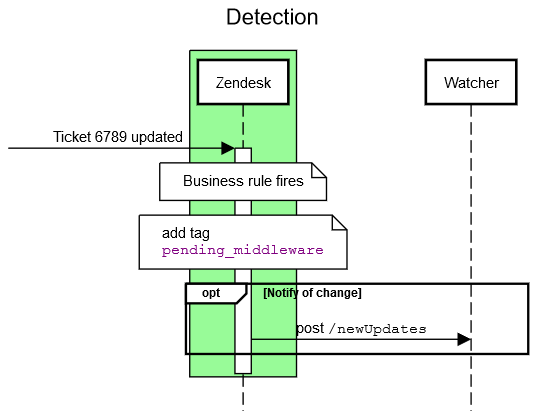
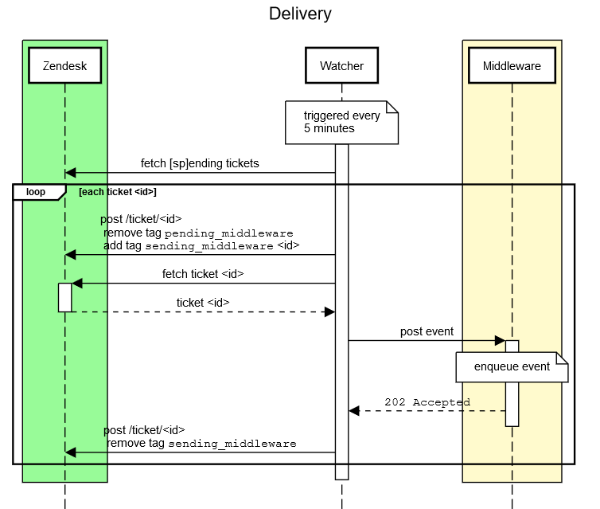

Zendesk does not provide guaranteed delivery of messages via its webhooks.  This design attempts to provide after-market features to provide such guarantee.

# Integration Overview

Zendesk is used by the Apprenticeship Service as one of a number of customer interaction tracking systems.  As part of the lifecycle of some tickets, investigation is may be required by teams that use one of the other systems.  At this point, the Zendesk tickets must be transferred to the other system, and the other system's updates must be transferred back to the Zendesk ticket.



Zendesk business rules ensure the ticket satisfies business conditions before being sent to the Monitor.  This is an example of the [business rules for escalated tickets](docs/escalate-to-middleware-rules.pdf).

# Requirements

A service which monitors the Zendesk application, and ensures that all webhook messages are reliably delivered to the middleware.  To accomplish this, the service must detect Zendesk tickets that have outstanding messages undelivered; and be capable of delivering those messages into the middleware reliably.

1. Run automatically and periodically without human intervention.
2. Detect Zendesk tickets where messages to the the middleware are pending.
3. Reliably deliver those messages, wit retires, until they are successfully received by the middleware.
4. Provide no visible difference in message delivery, so that the middleware is nescient of the message originator.
5. Alerts a human administrator in the case of problems with any of the above.
6. Have a single definition of messages, endpoints and business rules shared with Zendesk.
7. Minimise number of Zendesk API calls.
8. Be as simple as possible.

# Zendesk

Zendesk's behaviour is:

* When tickets are updated, business rules are triggered, which in turn can trigger webhooks.
* Webhook payload data is created using a [handlebar style templating system](https://support.zendesk.com/hc/en-us/articles/203662146-Understanding-Liquid-markup-and-Zendesk-Support).
* Zendesk will [try one time](https://support.zendesk.com/hc/en-us/articles/203662146-Understanding-Liquid-markup-and-Zendesk-Support) to deliver the payload to the webhook endpoint.
* Webhook failures are logged.
* After an unknown number (~25) of consequtive failures, the webhook is disabled.

There are some constraints in Zendesk that affect our ability to find webhook failures:

1. Zendesk's webhook error reporting is limited to the [last 25 failures per hook](https://developer.zendesk.com/rest_api/docs/support/target_failures#list-target-failures), with older failures being discarded
2. Zendesk's ticket search API is very limited
   1. Can only compare dates in inbuilt, not custom, fields
   1. Cannot search for the absence of value (unless it is highly specific)
   1. [Can only return 1,000 results](https://develop.zendesk.com/hc/en-us/articles/360022563994--BREAKING-New-Search-API-Result-Limits)
3. Zendesk has no webhook trigger mechanism other than its business rules that act upon ticket updates.

The key part above are that it is not **possible to reliably detect failures**, as more than 25 failures could occur before Zendesk is monitored, and early failures would then go unnoticed.  Therefore it is necessary to build in a detection mechanism, or eschew Zendesk's webhook entirely as unfit for purpose.

Reliable detection is nearly achieved by tagging tickets with a known marker.  When the middleware has successfully received the message and placed it in a duarble queue, it removes that tag from the Zendesk ticket.  This leaves tickets that contain the tag as having attempted to send update events but not having received an acknowledgement the event was received.  Combined with an ability to retry the event, this provides an at-least-once event delivery guarantee.

There is a race condition where the ticket is updated twice before the first acknowledgement is returned, and the second event is not received by the middleware.  The ticket would then have its marker tag removed but an event has gone missing.  Zendesk cannot put datetime / other programmatic elements in tags or custom fields, which limits our ability to guard against this.

# Design

Zendesk's webhook ability is fundamentally not up to the task of providing reliable delivery of messages, and actively disables itself after few concurrent delivery failures; Zendesk is unlikely to improve their product's reliability in the near future. Combined with the race condition mentioned above, it does not seem feasilbe to use the webhook mechanism to push ticket data into the middleware.  Instead, the only reliable way to get ticket updates from Zendesk is for the middleware to pull the data from Zendesk, either based on a generic "update" event fired by a webhook, or by polling Zendesk for updates.  Given that Zendesk's webhook mechanism is unreliable, polling seems a reasonable choice. 

The middleware has been designed to receive incoming events and is not currently capable of pulling changes out of the services it serves.  Pulling update from Zendesk would necessitate a change in the middleware operations to query the Zendesk API.  The change is quite beneficial as the the same resource endpoints that the middleware already uses for updating Zendesk would be used for reading ticket data. It would also completely remove a schema - there is no incoming data from a webhook post, so there is no need to define another schema that is different to the Zendesk API; the Zendesk webhook does not need to be careful to meet that schema; and the middleware need not validate incoming messages.  However, changes to the current middleware design to pull events from Zendesk are said to compromise its design ethos. 

Therefore neither end is capable of reliably ensuring that Zendesk ticket updates are communicated.  As such, a "Watcher" component becomes a middle-middleware, pulling events out of Zendesk and delivering them into the middleware.

This brings a few benefits:

* We are no longer trying to bolt reliability onto an inherantly unreliable process.
* We remove the necessity to re-implement Zendesk's webhooks.
* We remove an entire schema - the data flowing out of Zendesk can now be the same shape as the data flowing into Zendesk.
* We side-step Zendesk's built-in disablement of webhooks after 25 consequtive failures.
* We remove all (known) race conditions in integration (we are still beholden on the middleware's ordering of messages).
* Zendesk's 1,000 search limit is of no consequence as we are only looking for unprocessed tickets.
* Remove potential for out-of-order updates being processed by the middleware.

There are a couple of caveats:

* More Zendesk API calls are required, in order to retrieve the data.
* Searching Zendesk for tickets on all events is likely to put a higher processing burden on Zendesk than only searching for tickets for delivery failures.  This may negatively impact Zendesk.
* Zendesk update delivery to the middleware is no longer event driven and is instead polling based, which may not be desirable (there is a mitigation if this is a problem).
* A minimum level of implementation is required before the integration can be ready for beta testing.

---

---


# Failure and Monitoring

Given the recovery component's raison d'etre is to recover from failures, it would be right to assume it may encounter failures of its own.

Once determining there are tickets to recover, the watcher will first ascertain if the middleware is available.  After this is assured the watcher will start recovering the messages for the detected tickets.  During this process the middleware may once more become unavailable, at which point the watcher attempts to retry the message, backing off between each attempt.  After a (to-be-determined) total amount of time between retries the component will send an alert.

Proactive monitoring of the recovery component ("Watcher") will be provided by insights and alerting.  Given the nature of the expected rarity that the component will be required, it is natural to assume that passive monitoring via a dashboard will quickly be forgotten.  Therefore a simple traffic light embedded into some other actively monitored dashboard would be ideal; combined with alerts to as-yet-undetermined destinations. 

Insights will include diagnostics, that in the case of error should be easy to pinpoint any errors that occur.

# Failures and Race Scenarios

Some of the failure scenarios result in the same update event being posted to the middleware more than once - the Watcher is providing an "at-least-once" delivery guarantee.  The middleware must be idempotent in the face of receiving the same update event more than once.

# SonarCloud Analysis

SonarCloud analysis can be performed using a docker container which can be built from the included dockerfile.
An example of the docker run command to analyse the code base can be found below. 

## Example:

_docker run [OPTIONS] IMAGE COMMAND_ 

[Docker run documentation](https://docs.docker.com/engine/reference/commandline/run/)

```docker run --rm -v "$PWD":/root/projects/das-zendesk-monitor -w /root/projects/das-zendesk-monitor 65d98bf66d21 sh /root/projects/das-zendesk-monitor/analyse.sh```

### Options:

|Option|Description|
|---|---|
|--rm| Remove any existing containers for this image
|-v| Bind the current directory of the host to the given directory in the container ($PWD may be different on your platform). This should be the folder where the code to be analysed is
|-w| Set the working directory

### Command:

Execute the analyse.sh shell script